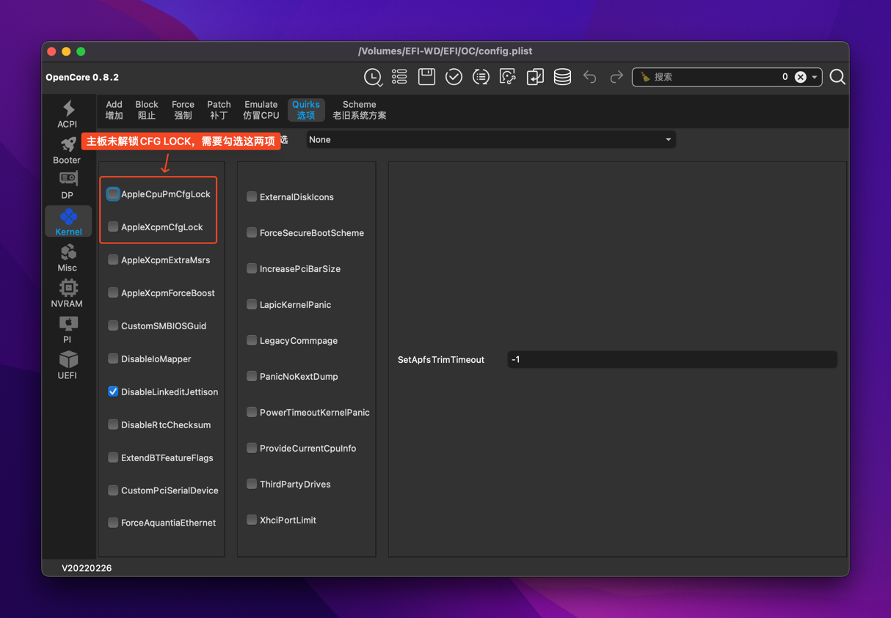

# Hackintosh EFI with OpenCore

## 配置

* 主板：技嘉 小雕 B365 M AORUS ELITE
* CPU：Intel® Core™ i5-9400F Processor(无核显)
* 显卡：迪兰（Dataland）RX 590 8G X战神 PLUS
* 内存：金士顿 (Kingston) FURY 16GB DDR4 2666 x2
* 固态硬盘：西部数据（Western Digital）500GB SSD固态硬盘 M.2接口（NVMe协议） WD Blue SN550
* 机械硬盘：希捷(Seagate)监控硬盘2TB 64MB 5900转 SATA 垂直 机械 PMR CMR 希捷酷鹰SkyHawk
* 蓝牙&无线网卡：Broadcom BCM94360CD
* 电源：航嘉（Huntkey）JUMPER600S 额定600W

## BIOS设置

* BIOS→CSM Support→Disabled（关闭CSM支持）
* Chipset→VT-d→Disabled
* Peripherals→USB Configuration→xHCI Hand-off→Enabled
* Peripherals→Above 4G Decoding→Disabled

## win10和mac下时间不一致解决的办法

win下cmd运行 `Reg add HKLM\SYSTEM\CurrentControlSet\Control\TimeZoneInformation /v RealTimeIsUniversal /t REG_DWORD /d 1`

## 解锁CFG LOCK

参考 [https://www.bilibili.com/read/cv6167464/](https://www.bilibili.com/read/cv6167464/)
或者在EFI配置里面勾选

* `Kernel -> Quirks -> AppleCpuPmCfgLock`

* `Kernel -> Quirks -> AppleXcpmCfgLock`

